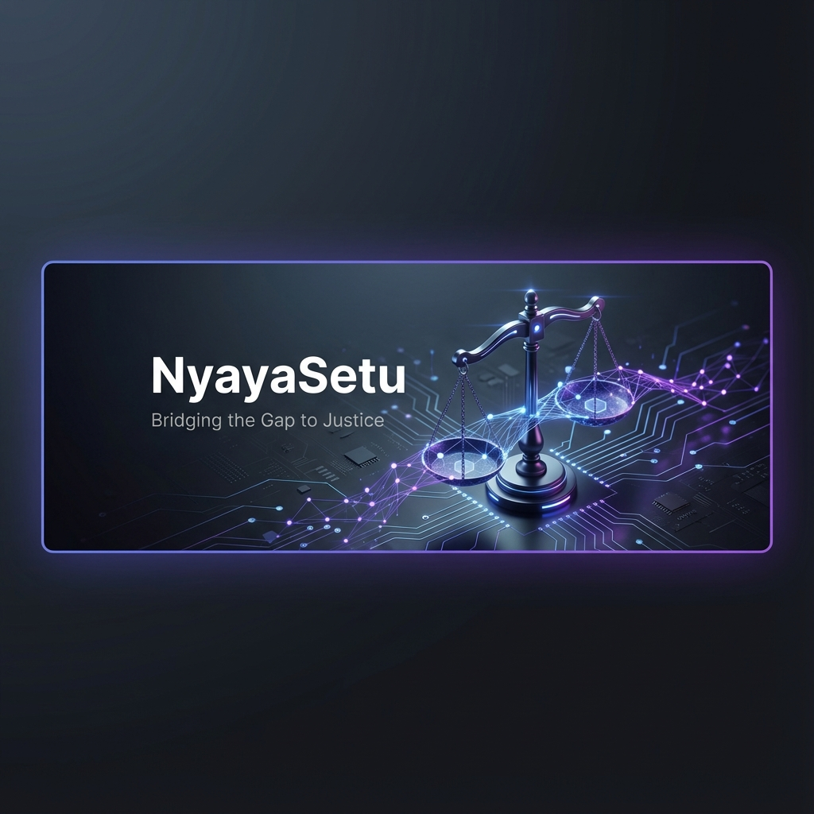

# NyayaSetu 🇮🇳⚖️

**Bridging the Gap Between Citizens and Justice.**

NyayaSetu is an AI-powered legal assistant and case management system designed to democratize access to justice in India. It combines advanced Generative AI with a robust judicial workflow engine to help citizens navigate the legal system, manage civil cases, and understand complex laws (BNS, BNSS, BSA).



---

## 🚀 Key Features

### 1. ⚖️ Judicial Management System (NEW)
A full-featured platform for managing civil litigation lifecycles.
*   **Event-Driven Workflow**: Automatically transitions cases through the Civil Procedure Code stages (Pre-Filing → Filing → Notice → Evidence → Judgment).
*   **Dynamic Timeline**: Visualizes case progress and history.
*   **AI Guidance**: Context-aware recommendations for the "Next Step" based on the current case stage.
*   **Document Vault**: Securely store and manage case-related documents.
*   **Intelligent Tracker**: Dashboard to monitor multiple cases simultaneously.

### 2. 🤖 AI Legal Chatbot ("Nyaya Sahayak")
*   **Legal Brain**: Fine-tuned on the **Bharatiya Nyaya Sanhita (BNS)**, **Bharatiya Nagarik Suraksha Sanhita (BNSS)**, and **Constitution of India**.
*   **RAG Engine**: Uses Retrieval Augmented Generation to cite specific sections of the law.
*   **Multilingual**: Supports **Hindi, English**, and regional languages.
*   **Voice-Enabled**: Speak to the assistant in your native tongue.

### 3. 📄 Samvidhan Setu (Document Simplifier)
*   **"Explain Like I'm 5"**: Upload complex legal notices or court orders (PDF/Images) and get a simple, actionable summary.
*   **Vision AI**: Analysis of scanned documents using Gemini Vision.

### 4. 🔐 Enterprise-Grade Security
*   **Session Management**: Secure, sliding-window sessions.
*   **Data Isolation**: Every user’s cases and chats are private.
*   **Admin Dashboard**: Oversight of system usage and user metrics.

---

## 🛠️ Tech Stack

*   **Backend**: Python 3.10+, FastAPI (Modular Router Architecture)
*   **AI Engine**: Google Gemini 1.5 Pro & Flash
*   **Vector Database**: ChromaDB (Local Persistence)
*   **Database**: SQLite + SQLAlchemy (Relational Data)
*   **Frontend**: HTML5, Jinja2, TailwindCSS, Vanilla JS

---

## 📂 Project Structure

```text
NyayaSetu/
├── backend/
│   ├── routers/        # Modular API Routes (Auth, Chat, Judicial, Tools)
│   ├── models.py       # Database Schemas (User, Case, Chat, Events)
│   ├── judicial_engine.py # Core Logic for Civil Workflow
│   ├── rag_engine.py   # AI & Vector Search Logic
│   └── main.py         # App Entry Point
├── templates/          # Jinja2 HTML Pages
├── static/             # Assets & Styles
├── data/               # Legal Knowledge Base (PDFs)
└── chroma_db_store/    # Embeddings
```

---

## ⚙️ Setup & Installation

### 1. Clone & Install
```bash
git clone https://github.com/yourusername/NyayaSetu.git
cd NyayaSetu
python -m venv venv
# Activate Venv (Windows: venv\Scripts\activate, Mac/Linux: source venv/bin/activate)
pip install -r requirements.txt
```

### 2. Configure Environment
Create a `.env` file:
```env
GEMINI_API_KEY=your_key
SECRET_KEY=your_secret
ACCESS_TOKEN_EXPIRE_MINUTES=30
```

### 3. Initialize Knowledge Base
(Only needed once)
```bash
python backend/ingest.py
```

### 4. Run the Platform
```bash
uvicorn backend.main:app --reload
```
Visit **http://localhost:8000**

---

## 🧪 Testing

*   **Default Login**: Register a new user or use `admin@nyaya.com` / `admin123` (if seeded).
*   **Verification**:
    *   **Judicial**: Create a case → Add "Filing" Event → Verify Stage changes to "Filing".
    *   **Chat**: Ask "What is the punishment for theft under BNS?".
    *   **Draft**: Go to Tools → Generate Draft -> "Rental Agreement for 11 months".

---

## 🤝 Contribution

We welcome contributions! Please follow the `backend/routers` pattern when adding new API endpoints.

```bash
git checkout -b feature/amazing-feature
git commit -m "Add Amazing Feature"
git push origin feature/amazing-feature
```

---
*Built with ❤️ for Justice.*
